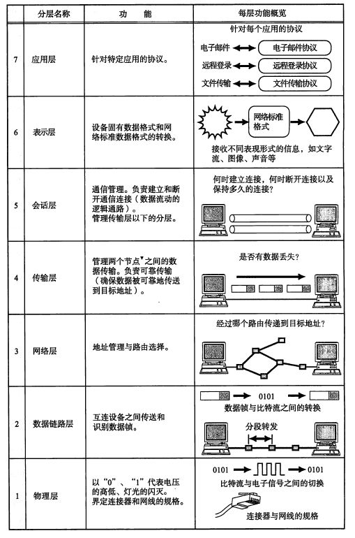
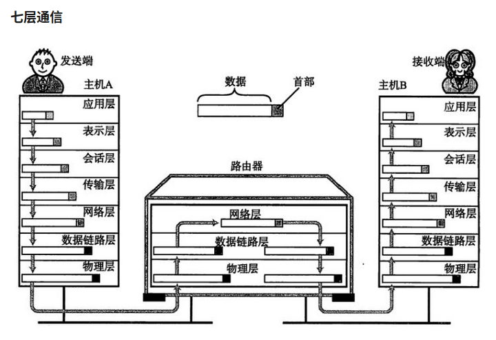
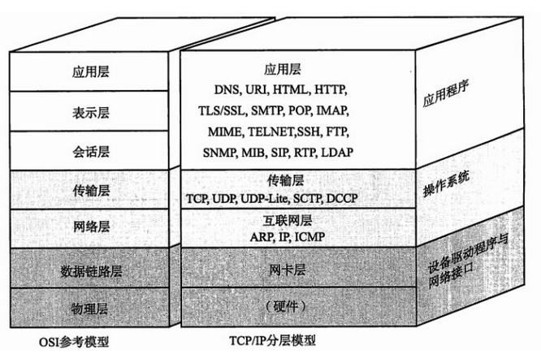
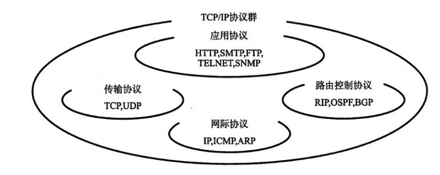

### 一、协议

​	简单来说，协议就是两台计算机在进行网络通讯的时候双方的一种“约定”。这种协议可以让不同厂商、不同的设备、不同的操作系统只要按照同样一种约定就能进行通讯。协议分为很多种，每一种协议都明确界定了它的行为规范。两台计算机必须能够支持相同的协议，并遵循相同协议进行处理，这样才能实现相互通信。

### 二、协议分层

​	网络协议通常分为不同的层次进行开发，每一层负责不同的通信功能。一个协议族，例如TCP/IP，是一组不同层次上面多个协议的组合。TCP/IP被认为是一个四层协议，而ISO（国际标准化组织）制定了一个ＯＳＩ标准（开放系统互联模型），这是一个七层模型。ＯＳＩ协议就是以ＯＳＩ参考模型为标准指定了每层的协议和每层之间接口相关的标准。

#### 1、ＯＳＩ七层协议的说明

​	

​	发送方在发送数据的时候从第七层到第一层从上往下的顺序进行处理数据，每一层把要处理的内容加上首部之后传递给下一层。接收方在接收数据的时候，从第一层到第七层从下往上对数据进行处理。每一层对接收到的数据进行内容和首部的分离，然后再转发给上一层。最终每一层都得到对应层发送的内容。

### 三、TCP详解

### 1、TCP/IP协议	

​	TCP/IP 是用于因特网 (Internet) 的通信协议。 TCP/IP 通信协议是对计算机必须遵守的规则的描述，只有遵守这些规则，计算机之间才能进行通信。

> TCP (Transmission Control Protocol)和UDP(User Datagram Protocol)协议属于传输层协议。其中TCP提供IP环境下的数据可靠传输，它提供的服务包括数据流传送、可靠性、有效流控、全双工操作和多路复用。通过面向连接、端到端和可靠的数据包发送。通俗说，它是事先为所发送的数据开辟出连接好的通道，然后再进行数据发送；而UDP则不为IP提供可靠性、流控或差错恢复功能。一般来说，TCP对应的是可靠性要求高的应用，而UDP对应的则是可靠性要求低、传输经济的应用。 
> TCP支持的应用协议主要有：Telnet、FTP、SMTP等； 
> UDP支持的应用层协议主要有：NFS（网络文件系统）、SNMP（简单网络管理协议）、DNS（主域名称系统）、TFTP（通用文件传输协议）等。 
> TCP/IP协议与低层的数据链路层和物理层无关，这也是TCP/IP的重要特点

|     区别     |     TCP      |      UDP       |
| :----------: | :----------: | :------------: |
| 是否面向连接 |      是      |       否       |
|   是否可靠   |      是      |       否       |
|   传输协议   | 传输控制协议 | 用户数据报协议 |
|   传输效率   |      低      |       高       |

#### 2、ｔｃｐ滑动窗口机制

​	ｔｃｐ是可靠的网络传输协议，可靠的意思就是接收方结束到发送方发送过来的数据的时候，既要保证接收到的包的序号是对的，同时要保证数据没有丢失。

​	一个非常简单的做法是使用一个确认应答机制，接收方接受完发送方发的一个数据包之后，对该数据包进行应答，然后发送方才能发送下一个数据包。这种同步通讯的方式当然可以解决数据传输的可靠性问题，但是带来一个很大的问题就是传输的效率极低。

​	为了解决这种简单的确认应答机制，ｔｃｐ提出了一种滑动窗口的概念。简单来说，就是可以保证发送方同时发送多个数据包，然后接收方接受到之后分别进行应答。这样可以大大地提高传输的效率。

### 四、抓包分析实验

#### 五、问题答疑

１、为什么连接是三次握手，关闭连接是四次挥手？

