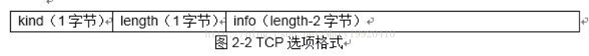
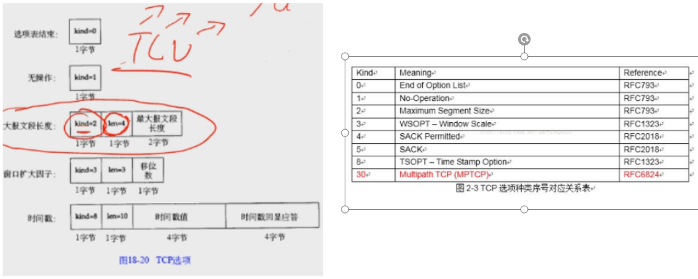

[TOC]

#### 一、TCP提供的服务（面向连接的可靠的字节流服务）

> tcp输入tcp ip协议的传输层协议，提供一种面向连接的可靠的字节流服务。

**1、面向连接：**

​	两方在进行交换数据之前需要建立一个TCP连接，同时连接仅仅是点对点，广播和多播不能用于TCP连接。TCP是全双工协议，连接的双方同时可以发送和接收。

**2、可靠传输**

（1）数据被TCP分割为它认为最适合发送的数据块大小。

（2）超时重传机制，TCP发送一个段，如果一段时间内没有收到对方的回复，那么它会认为是丢失或者发生错误了，会再发一次。

（3）延时确认，接收端收到报文后不是马上确认，而是延迟几分之一秒再确认。一方面，可以确认更多的数据；另一方面，如果有什么可以发送过去的数据可以连带着确认一起发过去，提高传输效率。

（4）TCP会对首部和数据同时校验。

（5）接收端会对收到的数据进行重新排序，保证接受数据的正确性。同时，接收端也会丢弃重复的数据。

（6）TCP有流量控制机制，双方都有发送缓冲和接收缓冲，并且会通知对方自己窗口的大小，防止传输较快的主机导致较慢的主机缓冲区溢出。

**3、字节流服务**

​	TCP交换的数据是8 bit构成的字节流。并且不对字节流数据做任何解释，它不知道传输的是二进制数据、ASCII字符或者其他类型数据，由应用层进行解释。

#### 二、TCP的首部分析

​	tcp首部默认大小为20个字节（不算tcp选项的话），如果算上tcp选项的话，首部最大可以达到60个字节。

**1、源端口和目的端口**

​	源端口和目的端口表示着两端各自的某个进程，分别是16位的大小（65536个端口号）。

**2、序号（seq）和确认序号（ack）**

​	TCP的序号共32位，标识着当前发送过去的段的第一个字节的序号；TCP的确认序号是32位，等于对上次成功接收到对方的序号加一，表示想要对方发送的下一个字节的序号。**（并且只有ACK = 1时才有效）**确认序号表示的是在该序号之前所有的序号都已经正常接收成功了。

**3、首部长度（Data offset）**

​	首部长度（4bit）：以四个字节为一个单位，最多有15 *4 = 60个字节。

**4、tcp标志位、窗口大小和校验和**

URG：紧急指针有效（紧急指针有效时，**16位的紧急指针Urgent pointer**和序号相加标识紧急数据的最后一个字节，但是紧急数据的初始字节由应用层进行指定）

ACK：确认序号有效

PSH：告知接收方应该尽快把数据交给应用层。

RST：发生错误，马上断开连接。

SYN：用于发起连接。

FIN：用于结束连接

​	window为通知窗口的大小，是接收方进行的流量控制，用于告诉对方，我当前的缓冲区还有多大。window字段共16位，以字节为单位，所以最大的窗口大小是65535个字节。

​	校验和是对段的数据和首部同时进行校验。

**5、tcp 首部可选项（option）**

（1）选项的格式

​	每个选项的第一个字节是kind字段，它表示的是选项的类型，例如0表示无选项，1表示误操作。然后接下来的字节表示该选项的长度，后面info data的长度等于length - 2。

​	其中kind的格式和常见的选项如下图所示

	

#### 三、tcp的连接和断开

#### 四、tcp的滑动窗口机制

#### 五、tcp的超时重传机制

#### 六、tcp拥塞避免算法、慢启动算法、快速重传、快速恢复算法

#### 七、tcp的坚持定时器和保活定时器

