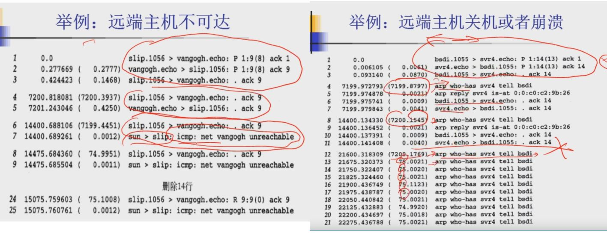

[TOC]

#### 一、TCP提供的服务（面向连接的可靠的字节流服务）

> tcp输入tcp ip协议的传输层协议，提供一种面向连接的可靠的字节流服务。

**1、面向连接：**

​	两方在进行交换数据之前需要建立一个TCP连接，同时连接仅仅是点对点，广播和多播不能用于TCP连接。TCP是全双工协议，连接的双方同时可以发送和接收。

**2、可靠传输**

（1）数据被TCP分割为它认为最适合发送的数据块大小。

（2）超时重传机制，TCP发送一个段，如果一段时间内没有收到对方的回复，那么它会认为是丢失或者发生错误了，会再发一次。

（3）延时确认，接收端收到报文后不是马上确认，而是延迟几分之一秒再确认。一方面，可以确认更多的数据；另一方面，如果有什么可以发送过去的数据可以连带着确认一起发过去，提高传输效率。

（4）TCP会对首部和数据同时校验。

（5）接收端会对收到的数据进行重新排序，保证接受数据的正确性。同时，接收端也会丢弃重复的数据。

（6）TCP有流量控制机制，双方都有发送缓冲和接收缓冲，并且会通知对方自己窗口的大小，防止传输较快的主机导致较慢的主机缓冲区溢出。

**3、字节流服务**

​	TCP交换的数据是8 bit构成的字节流。并且不对字节流数据做任何解释，它不知道传输的是二进制数据、ASCII字符或者其他类型数据，由应用层进行解释。

#### 二、TCP的首部分析

​	tcp首部默认大小为20个字节（不算tcp选项的话），如果算上tcp选项的话，首部最大可以达到60个字节。

**1、源端口和目的端口**

​	源端口和目的端口表示着两端各自的某个进程，分别是16位的大小（65536个端口号）。

**2、序号（seq）和确认序号（ack）**

​	TCP的序号共32位，标识着当前发送过去的段的第一个字节的序号；TCP的确认序号是32位，等于对上次成功接收到对方的序号加一，表示想要对方发送的下一个字节的序号。**（并且只有ACK = 1时才有效）**确认序号表示的是在该序号之前所有的序号都已经正常接收成功了。

**3、首部长度（Data offset）**

​	首部长度（4bit）：以四个字节为一个单位，最多有15 *4 = 60个字节。

**4、tcp标志位、窗口大小和校验和**

URG：紧急指针有效（紧急指针有效时，**16位的紧急指针Urgent pointer**和序号相加标识紧急数据的最后一个字节，但是紧急数据的初始字节由应用层进行指定）

ACK：确认序号有效

PSH：告知接收方应该尽快把数据交给应用层。

RST：发生错误，马上断开连接。

SYN：用于发起连接。

FIN：用于结束连接

​	window为通知窗口的大小，是接收方进行的流量控制，用于告诉对方，我当前的缓冲区还有多大。window字段共16位，以字节为单位，所以最大的窗口大小是65535个字节。

​	校验和是对段的数据和首部同时进行校验。

**5、tcp 首部可选项（option）**

（1）选项的格式

​	每个选项的第一个字节是kind字段，它表示的是选项的类型，例如0表示无选项，1表示误操作。然后接下来的字节表示该选项的长度，后面info data的长度等于length - 2。

​	其中kind的格式和常见的选项如下图所示

#### 三、tcp的连接和断开

**1、tcp的连接（三次握手，（告知对方自己的初始序号，并且对对方序号进行确认，同时可以告知对方自己的初始窗口大小））**

（1）建立连接的一方A发送自己的初始序号、SYN=1。（初始序号是随机选择的）

（2）B收到后发送自己的初始需要，并且对A的序号进行确认。同时ACK = 1，SYN =1。

（3）最后A对B的序号进行确认，同时ACK = 1。

**2、tcp断开连接（四次挥手）**

（1）主动断开连接的一方发送FIN=1，告知对方自己要断开连接。

（2）接收方对它的序号进行确认ACK_seq，并且ACK=1。主动断开连接的一方收到以后就进入断开发送状态（此时只能接收对方发送的数据还有发送ACK），同时整个tcp处于半连接状态。一方断开发送，另一方还可以发送和接收。

（3）另一方需要断开连接的时候，同样发送FIN=1给对方。

（4）对方对它进行确认。（ack和ACK）

**3、断开连接深入分析**

​	主动断开连接的一方接收到对方发送的FIN，并且发送ACK给对方之后会进入timewait状态。需要等待2 MSL（linux的一个MSL是30S），这里进入timewait的原因是为了防止发送过去的ACK丢失，对方的连接则一直不能关闭。有timewait的话，如果ACK丢失的话，对方可以超时重发FIN信号，然后这边再进行重新确认。

​	在等待2MSL的时间内，该连接还没有完全断开，**所以主动断开连接的一方的端口号在这段时间内**一直被占用，不能重新建立该端口号的连接，要等这段时间过了之后才可以。

#### 四、tcp的滑动窗口机制

**1、经受时延的确认。**

​	Tcp在收到数据的时候并不立即返回ACK，相反它推迟发送。就是等待一段时间（一般是200ms），把所有需要发送过去的数据搜集之后再一起发过去，这样可以提高传输效率。

**2、滑动窗口（最简单的滑动窗口详解）**

​	Tcp采用滑动窗口的机制来进行高效的数据传输。用户的发送窗口的大小一般由接收方进行指定大小，就是表示可以发送的不用经过接收方确认的大小（字节为单位）。

​	接收方每发送一个确认序号，窗口的左边就往右移动。并且根据接收方发送的窗口的大小，来确定当前的窗口的大小。

​	**滑动窗口是tcp流量控制的一个方面，可以看成是接收端的流量控制，接收方可以根据自己的处理速度，控制发送方的发送速度。**

​	具体的例子可以看下面的图片流程。

**3、带宽时延乘积**

​	带宽时延乘积用在网络状况较好的时候，为了更好地利用链路带宽，提高传输的效率，并且发送方能源源不断地收到对方的ACK，进而不断发送。

​	所以，一开始把通告窗口（window size）设置为大于带宽和往返时间的乘积。具体公式如下图所示。这样设置的原因是，第一个发送出去的数据至少要通过RTT时间才能收到，那么把刚开始的窗口设置为capacity大小的话，在第一个ACK返回来之前，发送端的窗口还不为0，还可以持续发送。紧接着，收到ack，就可以源源不断地发送。

#### 五、tcp的超时重传机制

​	tcp主要有四种定时器：重传定时器、坚持定时器、保活定时器和2MSL定时器。相关的介绍见下图所示：

**1、重传定时器（retransmission time out，RTO）**

​	重传定时器体现了tcp连接的超时重传机制。当发送方发送一个报文的时候，如果在规定时间内收不到对方的确认，就会触发一次超时重传，重新发送数据给接收端。如果连续触发了好几次超时重传，tcp发送方会认为该连接已经凉了，主动断开连接。

​	当发送方有数据发送时，超时重传也可以看做是用来检测tcp连接是否正常的一种手段。如果发送过去的数据对方一直没有回复，并且触发了多次超时重传，那么发送方就可以认为接收方已经失去联系，主动断开连接。

（1）简单的重传定时器的例子

双方建立连接，然后把网线给拔了，发送方触发了好几次超时重传，然后在九分钟之后断开了连接。

**（2）超时重传时间的动态设置**

​	要点：tcp在任何时刻仅对每次连接测量一次RTT值；

​	每发送一次包，会启动一次滴答定时器，当这个包被确认之后，记录下当前的RTT值，并且关闭对应的滴答定时器；

​	如果ACK到达之前，该数据包没有被重传，那么该RTT值就可以参与超时重传时间的设置，否则的话，就抛弃当前的计算。

​	Tcp的超时重传最重要的部分就是计算RTT值，并且因为网络状态的多变性，RTT值经常发生变化。所以，tcp应该根据这些变化，动态修改超时重传时间。

​	主要有以下几种算法：RFC793、Jacobson 1988。

**（3）超时重传时间初始值的设置**

​	在网络开始的阶段，发送第一个报文的时候，还没有收到对方的ack确认，无法计算相应的RTT值，那么RTO值怎么设置呢？Tcp提供了一种关于RTO初始值的计算方法，如下图所示。同时，这边还给了一个例子，计算从一开始，到逐渐收到报文确认之后，RTO值的变化。

#### 六、tcp拥塞避免算法、慢启动算法、快速重传、快速恢复算法

**1、tcp的慢启动（发送方的流量控制）**

​	前面的简单例子都是发送方一开始便发送多个报文段，知道达到接收方通知的窗口大小。当发送方和接收方处于同一个局域网的时候，这种操作是可以的。但是如果发送方和接收方之间存在多个路由和速度较慢的链路的时候，就会出现问题。（网络拥堵的时候，一开始发送太多的话，就会丢包。然后因为超时重传或者三次确认重传的机制，又会发送很多包进入网络，导致网络更加拥堵，进入死循环）。所以，tcp的设计者设计了一个慢启动的机制，通过探测当前的网络环境，调整自己的发送窗口大小。

​	慢启动为TCP发送方设置了一个拥塞窗口（congestion window：cwind），刚开始的时候cwind=1，然后每接受一个ACK确认，cwind+1。意思就是说，每次发送方收到所有发送出去的包的回复的时候，ACK都2倍指数增长。

**2、拥塞避免算法（经常和慢启动算法联合使用，同时作为发送方的流量控制）**

介绍拥塞避免算法之前，我们先来介绍两种丢失分组的指示：发送一个分组的时候，如果超过RTO时间都没有收到对方的确认，就会引发一次超时重传；如果发送方连续三次收到对方的ack确认某段报文没有及时收到，也会产生丢失分组的行为。

拥塞避免算法和慢启动算法的联合使用：

（1）对于一个给定的连接，cwnd = 1，ssthresh = 65535。

（2）对于tcp发送方来说，此时的window size（未经确认可以发送的报文个数） = Min（cwind，接收方通知的窗口大小）。

（3）当cwnd小于或者等于sstresh的时候，执行慢启动的算法，每收到一个ack的确认，cwnd+1，整个过程cwnd是指数增长的；当cwnd 大于sstresh的时候，执行拥塞算法，每个ack确认，cwnd增加1/cwnd，整个过程是线性增长的。

（4）当发生超时或者重复确认的时候，sstresh设置为当前cwind的一半。如果是超时引起的话，cwind设置为1；如果是重复确认的话，cwind设置为2。然后重复执行3的步骤（慢启动，达到sstresh，然后拥塞避免）

具体的例子如下：

**3、快速重传**

​	如果收到接收方连续3个重复的ACK确认，发送方马上发送丢失的数据报文段，不用等待超时重传。

**4、快速恢复算法**

（1）当发送发连续接收到三个确认时，就执行乘法减小算法，把慢启动开始门限（ssthresh）减半，但是接下来并不执行慢开始算法。

（2）此时不执行慢启动算法，而是把cwnd设置为当前的ssthresh， 然后执行拥塞避免算法，使拥塞窗口缓慢增大。

#### 七、tcp的坚持定时器和保活定时器

1、坚持定时器

（1）坚持定时器解决的问题

​	Tcp协议只对包含有数据的报文进行确认，但是不对确认报文进行确认。正常情况下是没有问题的，因为如果确认报文丢失了，发送方会启动超时重传，重新发送该数据报文，重新接收该报文的确认。

​	但是在特殊情况下，如果上一次收到的确认报文的窗口为0，下一次收到确认报文的窗口更新了，但是此时这条确认报文丢失了。那就惨了，因为此时的窗口状态显示对方的通知窗口大小为0，那么我无法往对方发送数据，而对方也不会主动给我发新的窗口数据信息，那么就相当于死锁在这里了，凉凉。

​	例如下图所示的状态就是典型的状态。

 （2）坚持定时器的用法和特点

​	为了解决这种问题，发送方使用一个坚持定时器来周期性地想接收方查询此时的窗口是否增大。这些从发送方发出去的报文段称为窗口探查。

​	**坚持定时器特点：**

​	收到一个窗口大小为0的通告后，发送的下一个查询窗口的报文的时间间隔是4.996，之后的时间间隔依次是6s,12,24,48等等。

​	窗口探查数据包包含一个字节的数据，返回来的ack不断对前一个字节进行确认，并且返回当前的窗口大小。（下图是坚持定时器的一个例子）

2、tcp的保活定时器（keep alive）

（1）什么是保活定时器？保活定时器的优点和缺点。

​	保活定时器就是心跳包的意思，一方隔一段时间向另一方发送心跳包，收到对方的回复之后才能确认对方活着。

​	优点：可以用来检测已经连接但是长期没有数据通讯的连接是否断了。

​	缺点：耗费带宽、

（2）Tcp如何使用保活定时器。

​	如果一个给定的连接在两个小时之内没有任何动作，则服务器就想客户发送一个探查报文段。

​	如果主机运行正常，那么它就回复报文告诉我正常，然后保活定时器两小时后又重新复位；

​	如果主机崩溃，服务器收不到一个相应的化，那么服务器会发送10次报文探查，每两个探查隔75秒，如果都没收到一个回复，则认为客户主机已经关闭并且终止连接；

​	如果客户主机崩溃并且重新启动，服务器收到一个响应，但这个响应是RST复位，服务器则终止连接。（下面两个图是例子）

