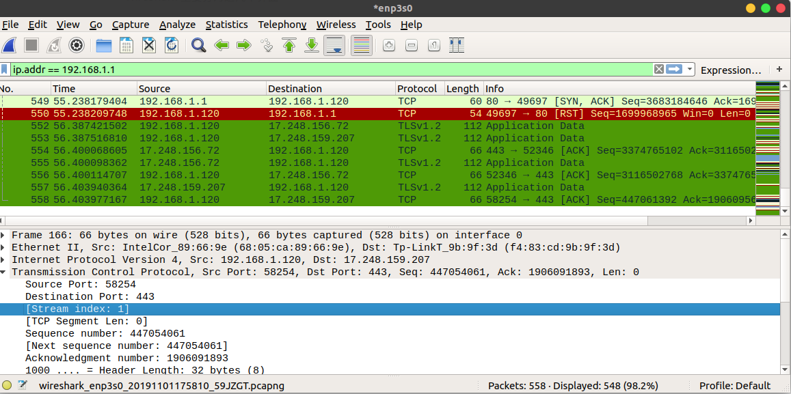

### 一、安装和配置wireshark

https://ywnz.com/linuxjc/4002.html

### 二、wireshark界面和基本功能介绍

**1、简单介绍**

WireShark 主要分为这几个界面

​	Display Filter(显示过滤器)，用于过滤

​	Packet List Pane(封包列表)，显示捕获到的封包，有源地址和目标地址，端口号。颜色不同

​	Packet Details Pane(封包详细信息), 显示封包中的字段

​	Dissector Pane(16进制数据)

​	Miscellanous(地址栏，杂项)

**2、封包列表**

No列编号，Time列是开启监控后到接受包的时间，Source是源IP，Destination是目标IP， Protocal是协议，Length是包长度，Info是包信息。

**３、封包详细信息**

这个面板是我们最重要的，用来查看协议中的每一个字段。各行信息分别为:

- Frame: 物理层的数据帧概况
- Ethernet II: 数据链路层以太网帧头部信息
- Internet Protocol Version 4: 互联网层IP包头部信息
- Transmission Control Protocol: 传输层的数据段头部信息，此处是TCP
- Hypertext Transfer Protocol: 应用层的信息，此处是HTTP协议

**４、过滤器**

WireShark使用过程中最方便的就是它的过滤器了。分为两种:

- 捕捉过滤器：用于决定将什么样的信息记录在捕捉结果中，需要在开始捕捉前设置。

  https://wiki.wireshark.org/CaptureFilters

- 显示过滤器：在捕捉结果中进行详细查找，他们可以在得到捕捉结果后随意修改。

  https://wiki.wireshark.org/DisplayFilters

  

### 三、非常方便的工具和技巧

１、如何查找域名对应的ip（举百度为例）

(1)ping baidu.com

(2)nslookup，然后输入baidu.com

(3)tcpping www.baidu.com

### 四、抓包分析例子（抓包的时候记得关闭ｖｐｎ）

１、抓包分析某个网卡（百度为例）

（１）点击ｃａｐｔｕｒｅ的ｏｐｔｉｏｎ，选择好通讯网卡，然后在ｃａｐｔｕｒｅ　ｆｉｌｔｅｒ内容框里面填写host www.baidu.com

（２）然后打开百度网页，就能看到一堆ｔｃｐ包

２、抓包分析某个ｉｐ

１选择网卡，然后在ｄｉｓｐｌａｙ　ｆｉｌｔｅｒ里面写ip.addr == ip地址　and tcp

(2)点击开始，就可以抓包分析。